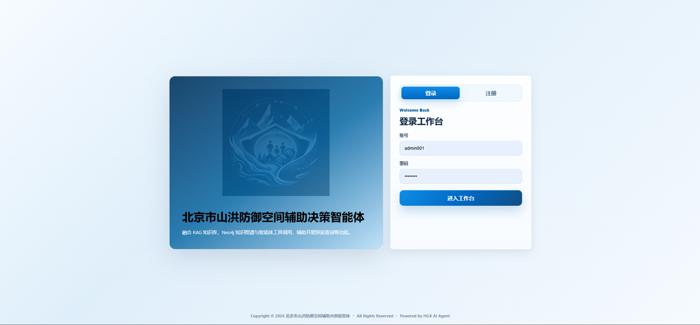
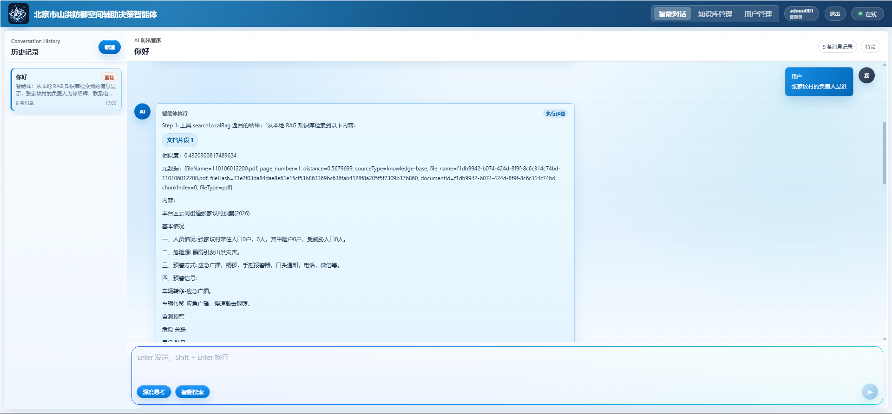
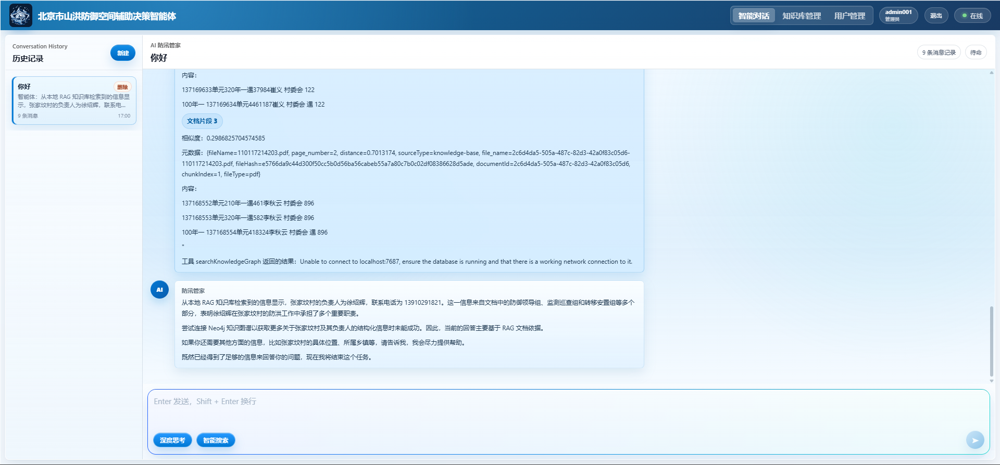
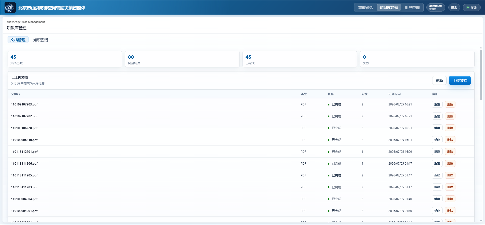
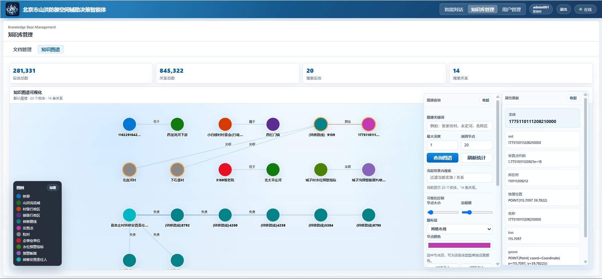
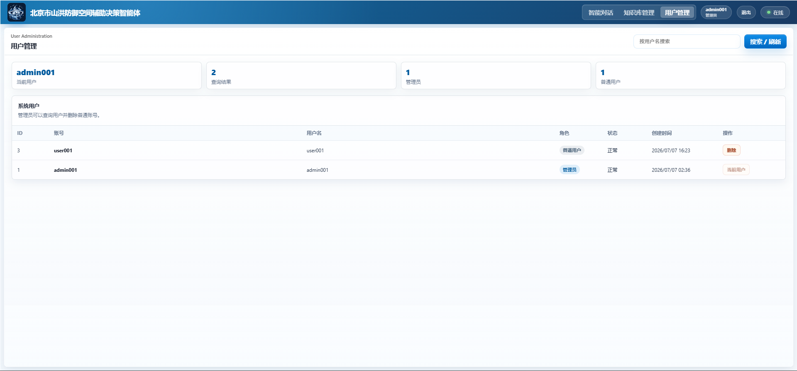
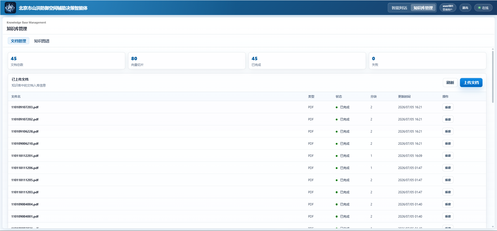

# 北京市山洪防御辅助决策智能体

一个面向山洪灾害防御场景的 AI 应用项目，融合 RAG 知识库、Neo4j 知识图谱和 Agent Tool Calling，辅助用户进行防洪预案查询、险村信息检索、监测站分析、转移路线研判和空间对象排查。

> 本项目仅用于学习、研究和辅助分析，不作为正式预警发布系统或防汛指挥系统。涉及人员转移、预警发布、应急响应等内容，应以属地防汛部门和正式预案为准。

## 登录界面（分为管理员和用户界面）
> 
## 智能体思考界面

## 智能体给出回答结果界面

## 知识库管理界面（管理员界面）

## 知识图谱界面

## 用户管理界面

## 知识库管理界面（普通用户界面）


## 项目亮点

- 基于 `Spring AI` 构建智能体问答链路，支持 ReAct Agent、Tool Calling 和 SSE 流式响应。
- 基于 `PostgreSQL + pgvector` 搭建本地 RAG 知识库，支持 PDF 上传、切分、向量化、检索和重建。
- 基于 `Neo4j` 构建知识图谱，支持实体关系查询、多跳路径推理和图谱增强问答。
- 支持用户登录注册、管理员权限、用户级多轮对话历史和会话管理。
- 基于 `Vue3 + Axios` 开发前端页面，包含智能对话、知识库管理、文档管理和知识图谱可视化。
- 提供生产环境配置和 Dockerfile，便于云端部署。

## 技术栈

### 后端

- Java 17
- Spring Boot 3
- Spring AI
- DashScope / 通义千问
- PostgreSQL
- pgvector
- Neo4j
- JDBC
- Docker

### 前端

- Vue3
- Vite
- Axios
- SSE
- CSS 响应式布局

## 功能模块

### 智能体问答

- 山洪防御业务问答
- 防洪预案内容检索
- RAG 知识库增强回答
- Neo4j 知识图谱增强推理
- 工具调用与多步骤任务执行
- SSE 流式输出

### 知识库管理

- PDF 文档上传
- 批量上传
- 文档切分与向量化
- pgvector 向量入库
- 文档重建
- 文档删除
- 防重复导入

### 知识图谱

- 实体和关系统计
- 实体检索
- 关系检索
- 节点属性查看
- 关系属性查看
- 图谱可视化
- 多跳关系推理

### 用户与会话

- 用户注册
- 用户登录
- 用户退出
- 管理员用户管理
- 多轮对话历史
- 用户级会话隔离
- 历史会话删除
- 30 天历史记录保留策略

## 目录结构

```text
hgx-ai-agent
├── src/main/java/com/hgx/hgxaiagent
│   ├── agent              # Agent 核心逻辑
│   ├── app                # AI 应用封装
│   ├── chat               # 对话历史模块
│   ├── config             # 全局配置
│   ├── controller         # 后端接口
│   ├── knowledge          # 知识库文档管理
│   ├── knowledgegraph     # Neo4j 知识图谱模块
│   ├── rag                # RAG 与向量库配置
│   ├── tools              # Tool Calling 工具
│   └── user               # 用户模块
├── src/main/resources
│   ├── application.yml
│   └── application-prod.yml
├── hgx-ai-agent-frontend  # Vue3 前端项目
├── Dockerfile             # 后端 Dockerfile
└── DEPLOYMENT_WECHAT_CLOUD.md
```

## 环境要求

- JDK 17+
- Maven 3.8+
- Node.js 20+
- pnpm
- PostgreSQL 16+
- pgvector 扩展
- PostGIS 扩展，可选
- Neo4j 5.x

## 后端配置

生产环境使用环境变量配置，不要在代码中写真实密钥。

```bash
DASHSCOPE_API_KEY=your_dashscope_api_key
DASHSCOPE_CHAT_MODEL=qwen-max

SPRING_DATASOURCE_URL=jdbc:postgresql://your-postgres-host:5432/hgx_ai_agent
SPRING_DATASOURCE_USERNAME=your_username
SPRING_DATASOURCE_PASSWORD=your_password

SPRING_NEO4J_URI=bolt://your-neo4j-host:7687
SPRING_NEO4J_USERNAME=neo4j
SPRING_NEO4J_PASSWORD=your_password

SEARCH_API_KEY=your_search_api_key
KNOWLEDGE_STORAGE_DIR=/data/knowledge-documents
```

PostgreSQL 需要开启扩展：

```sql
CREATE EXTENSION IF NOT EXISTS vector;
CREATE EXTENSION IF NOT EXISTS postgis;
```

## 本地启动

### 启动后端

```bash
./mvnw spring-boot:run
```

Windows PowerShell：

```powershell
.\mvnw.cmd spring-boot:run
```

默认访问地址：

```text
http://localhost:8123/api
```

### 启动前端

```bash
cd hgx-ai-agent-frontend
pnpm install
pnpm dev
```

默认访问地址：

```text
http://localhost:5173
```

## 主要接口

接口统一前缀：

```text
/api
```

### AI 智能体

```text
GET /ai/manus/chat
```

### 用户模块

```text
POST /user/register
POST /user/login
GET  /user/current
GET  /user/search
POST /user/delete
POST /user/logout
```

### 对话历史

```text
GET    /chat/conversations
POST   /chat/conversations
GET    /chat/conversations/{conversationId}/messages
DELETE /chat/conversations/{conversationId}
```

### 知识库文档

```text
GET    /knowledge/documents
POST   /knowledge/documents/upload
POST   /knowledge/documents/{documentId}/rebuild
DELETE /knowledge/documents/{documentId}
```

### 知识图谱

```text
GET /knowledge/graph/health
GET /knowledge/graph/stats
GET /knowledge/graph/search
GET /knowledge/graph/nodes/{nodeId}
GET /knowledge/graph/relationships/{relationshipId}
GET /knowledge/graph/visualize
```

## Docker 部署

后端构建：

```bash
docker build -t hgx-ai-agent-backend .
```

前端构建：

```bash
cd hgx-ai-agent-frontend
docker build -t hgx-ai-agent-frontend .
```

更多云托管部署说明见：

```text
DEPLOYMENT_WECHAT_CLOUD.md
```


## 项目状态

当前项目主要用于 AI 应用开发、Agent 开发、RAG 知识库和知识图谱增强问答方向的学习与实践。

